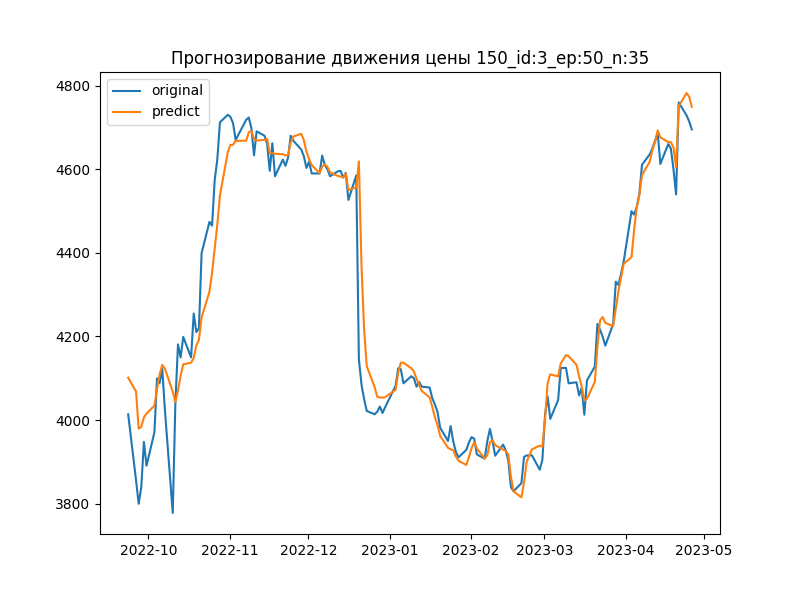

# Stock Price predict

## Information

Stock price prediction based on 5 years of price data.

* Data price
<table class="table table-bordered table-hover table-condensed">
<thead><tr><th title="Field #1">FIELD1</th>
<th title="Field #2">local_description</th>
<th title="Field #3">full_name</th>
<th title="Field #4">isin</th>
<th title="Field #5">pricescale</th>
<th title="Field #6">date</th>
<th title="Field #7">open</th>
<th title="Field #8">high</th>
<th title="Field #9">low</th>
<th title="Field #10">close</th>
<th title="Field #11">volume</th>
</tr></thead>
<tbody><tr>
<td align="right">0</td>
<td>СБЕРБАНК РОССИИ ПАО АО</td>
<td>MOEX:SBER</td>
<td>RU0009029540</td>
<td align="right">100</td>
<td>2015-12-24 07:00:00</td>
<td align="right">103.75</td>
<td align="right">103.89</td>
<td align="right">100.4</td>
<td align="right">101.35</td>
<td align="right">72255898.0</td>
</tr>
<tr>
<td align="right">1</td>
<td>СБЕРБАНК РОССИИ ПАО АО</td>
<td>MOEX:SBER</td>
<td>RU0009029540</td>
<td align="right">100</td>
<td>2015-12-25 07:00:00</td>
<td align="right">101.83</td>
<td align="right">102.32</td>
<td align="right">100.78</td>
<td align="right">101.34</td>
<td align="right">26197788.0</td>
</tr>
<tr>
<td align="right">2</td>
<td>СБЕРБАНК РОССИИ ПАО АО</td>
<td>MOEX:SBER</td>
<td>RU0009029540</td>
<td align="right">100</td>
<td>2015-12-28 07:00:00</td>
<td align="right">101.2</td>
<td align="right">101.54</td>
<td align="right">99.459999</td>
<td align="right">100.2</td>
<td align="right">36924618.0</td>
</tr>
<tr>
<td align="right">3</td>
<td>СБЕРБАНК РОССИИ ПАО АО</td>
<td>MOEX:SBER</td>
<td>RU0009029540</td>
<td align="right">100</td>
<td>2015-12-29 07:00:00</td>
<td align="right">100.49</td>
<td align="right">102.5</td>
<td align="right">99.739998</td>
<td align="right">101.82</td>
<td align="right">72703688.0</td>
</tr>
<tr>
<td align="right">4</td>
<td>СБЕРБАНК РОССИИ ПАО АО</td>
<td>MOEX:SBER</td>
<td>RU0009029540</td>
<td align="right">100</td>
<td>2015-12-30 07:00:00</td>
<td align="right">101.67</td>
<td align="right">101.85</td>
<td align="right">100.47</td>
<td align="right">101.26</td>
<td align="right">38868078.0</td>
</tr>
<tr>
<td align="right">5</td>
<td>СБЕРБАНК РОССИИ ПАО АО</td>
<td>MOEX:SBER</td>
<td>RU0009029540</td>
<td align="right">100</td>
<td>2016-01-04 07:00:00</td>
<td align="right">101.0</td>
<td align="right">101.78</td>
<td align="right">97.940002</td>
<td align="right">98.010002</td>
<td align="right">51264548.0</td>
</tr>
</tbody></table>    

* Result of predict

